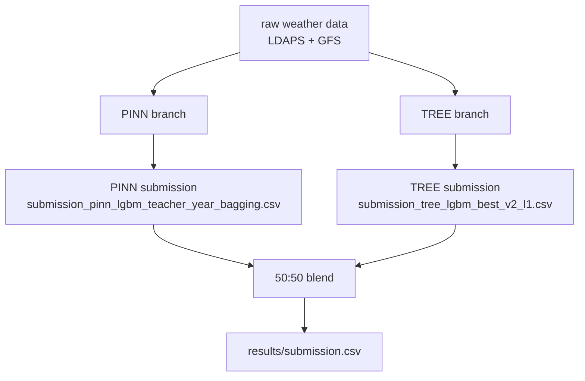

# Best Model Pipeline

작성일: 2026-07-08 10:05:43 +09:00

이 문서는 현재 최고 성능 제출 모델을 처음 보는 사람이 그대로 재현할 수 있게 정리한 것이다.

현재 안정 모델은 **PINN 50% + tuned LGBM TREE 50%** 이다.

- 최종 제출 파일: `results/submission.csv`
- public 확인 점수: 약 `0.63040`
- public 1-nMAE: 약 `0.86668`
- public FICR: 약 `0.40123`
- 내부 OOF 검증 점수: `0.62679`

검증에서는 TREE 비중 `0.60`이 `0.62749`로 조금 더 좋았지만, 실제 public/test 차이를 고려해서 제출 기본값은 **50:50** 으로 둔다.

## 한 줄 요약

날씨만으로 직접 발전량을 예측하면 부족하다. 그래서 두 모델을 같이 쓴다.

| Branch | 역할 | 강점 | 약점 |
|---|---|---|---|
| PINN | 물리 제약과 SCADA teacher를 이용한 발전량 예측 | peak/FICR 쪽 보조 | nMAE가 TREE보다 약함 |
| tuned LGBM TREE | weather/meteo/power-curve 기반 group별 회귀 | nMAE와 안정성 | FICR peak가 PINN보다 약함 |
| 50:50 blend | 두 모델 평균 | 안정성 + FICR 보완 | 큰 개선은 TREE 품질에 의존 |

## 전체 흐름



## 검증 방식

검증은 year-fold OOF를 기본으로 본다.

| Fold | 학습 | 검증 |
|---|---|---|
| fold 1 | 2023, 2024 | 2022 |
| fold 2 | 2022, 2024 | 2023 |
| fold 3 | 2022, 2023 | 2024 |

핵심은 검증 연도의 정보를 학습에 직접 넣지 않는 것이다.

- SCADA teacher는 검증 연도 raw SCADA를 직접 쓰지 않고, 학습 연도로 학습한 teacher가 검증 연도 teacher feature를 예측한다.
- TREE의 power-curve feature도 train row에는 OOF 방식으로 만들고, test에는 전체 train으로 다시 만든 curve를 적용한다.
- 최종 submission은 각 branch가 만든 예측을 capacity 범위로 clamp한 뒤 blend한다.

## PINN Branch

실행 파일:

- `predict_pinn_effective_grid_g1_year_bagging.py`
- `train_pinn.py`
- `utils/pinn_effective_pipeline.py`
- `utils/pinn_scada_teacher_config.py`

현재 PINN은 `lgbm_time_oof` teacher backend를 쓴다.

직관적으로는 아래 흐름이다.

```text
weather -> LGBM teacher로 SCADA/effective wind proxy 예측 -> PINN -> 발전량 예측
```

중요한 점은 PINN 학습 때 raw SCADA를 그대로 넣지 않는 것이다. train row에도 teacher 예측값을 넣어야 실제 test 상황과 맞는다. 이 부분이 성능 과대평가와 누수를 막는 핵심이다.

### PINN 주요 설정

`utils/pinn_scada_teacher_config.py` 기준:

| 설정 | 값 |
|---|---:|
| `LR` | `0.00119518` |
| `GAMMA` | `0.00682273` |
| `BIAS_LR` | `0.00201426` |
| `lambda_betz` | `0.29310056` |
| `lambda_bc` | `0.00035899` |
| `lambda_flat` | `0.06738267` |
| `lambda_smooth` | `0.00323965` |
| `lambda_hod` | `0.00004575` |
| `lambda_moy` | `0.001` |
| `lambda_hour` | `0.01` |
| `lambda_year` | `0.01` |

`train_pinn.py` 기준:

| 설정 | 값 |
|---|---:|
| stage 1 epochs | `500` |
| stage 2 epochs | `2000` |
| train-only hour bias | `False` |
| train-only year bias | `False` |
| month-of-year bias | `False` |
| hour-of-day bias | `True` |

### LGBM Teacher 설정

`utils/pinn_effective_pipeline.py`의 `_make_lgbm_teacher` 기준:

| 파라미터 | 값 |
|---|---:|
| `n_estimators` | `700` |
| `learning_rate` | `0.035` |
| `num_leaves` | `48` |
| `min_child_samples` | `80` |
| `subsample` | `0.85` |
| `colsample_bytree` | `0.85` |
| `reg_alpha` | `0.05` |
| `reg_lambda` | `2.0` |
| time folds | `5` |

## TREE Branch

실행 파일:

- `predict_power_lgbm_best.py`
- `experiments/tune_power_lgbm_hyperparams.py`
- `experiments/evaluate_power_lgbm_best.py`

TREE는 group별로 다른 LGBM 하이퍼파라미터를 쓴다.

직관적으로는 아래 흐름이다.

```text
weather/meteo features
-> OOF power-curve feature 추가
-> group별 tuned LGBM
-> 발전량 예측
```

현재 TREE는 `results/power_lgbm_hyperparams_v2_l1_20_best.csv`에 저장된 group별 최적값을 사용한다.

공통 정책:

| 설정 | 값 |
|---|---|
| objective | `regression_l1` |
| low-output cutoff | `min_output_ratio = 0.1` |
| sample weight | `actual_sqrt` |
| validation | year-fold OOF |

### Group별 LGBM 최적 하이퍼파라미터

| Group | trial | score | nMAE | FICR | worst fold |
|---|---:|---:|---:|---:|---:|
| group1 | `8` | `0.622594` | `0.124682` | `0.369870` | `0.604712` |
| group2 | `12` | `0.647782` | `0.123648` | `0.419212` | `0.637523` |
| group3 | `10` | `0.582762` | `0.143102` | `0.308625` | `0.577643` |

| Group | `n_estimators` | `learning_rate` | `num_leaves` | `max_depth` | `min_child_samples` |
|---|---:|---:|---:|---:|---:|
| group1 | `1646` | `0.0203991594` | `128` | `6` | `80` |
| group2 | `1147` | `0.0144991591` | `48` | `6` | `160` |
| group3 | `1309` | `0.0259778246` | `64` | `4` | `80` |

| Group | `subsample` | `colsample_bytree` | `reg_alpha` | `reg_lambda` | `min_split_gain` | `random_state` |
|---|---:|---:|---:|---:|---:|---:|
| group1 | `0.8184083164` | `0.7571670024` | `0.0081840132` | `1.8139900710` | `0.0265533784` | `20260709008` |
| group2 | `0.9438219366` | `0.7670068382` | `0.0333872971` | `3.1545764871` | `0.0527314458` | `20260709012` |
| group3 | `0.7483047258` | `0.6741920876` | `0.0011754614` | `2.8931055157` | `0.0406495774` | `20260709010` |

## 최종 Blend

최종 기본값은 PINN 50%, TREE 50%이다.

```text
final_prediction = 0.5 * pinn_prediction + 0.5 * tree_prediction
```

OOF 검증 결과:

| TREE weight | score | nMAE | FICR | 판단 |
|---:|---:|---:|---:|---|
| `0.50` | `0.626789` | `0.130011` | `0.383588` | 현재 안정 제출 기본값 |
| `0.60` | `0.627492` | `0.128792` | `0.383776` | 검증 최고, 다만 public 차이 우려 |
| `1.00` | `0.623611` | `0.128505` | `0.375727` | TREE only |
| `0.00` | `0.612594` | `0.142675` | `0.367863` | PINN only |

## 동일 결과 재현

권장 환경 이름은 `WindForecast`이다.

```powershell
conda run -n WindForecast python --version
```

### 1. PINN OOF 검증 재현

```powershell
conda run -n WindForecast python experiments\evaluate_pinn_effective_grid_g1_year_bagging_oof.py --teacher-backend lgbm_time_oof
```

주요 출력:

- `results/pinn_effective_grid_g1_year_bagging_lgbm_time_oof_oof_predictions.csv`
- `results/pinn_effective_grid_g1_year_bagging_lgbm_time_oof_oof_scores.csv`

### 2. TREE 하이퍼파라미터 탐색 재현

이미 최적값 CSV가 있으면 이 단계는 생략 가능하다.

```powershell
conda run -n WindForecast python experiments\tune_power_lgbm_hyperparams.py --trials 20 --seed 20260709 --search-space focused_l1 --stem power_lgbm_hyperparams_v2_l1_20
```

주요 출력:

- `results/power_lgbm_hyperparams_v2_l1_20_trials.csv`
- `results/power_lgbm_hyperparams_v2_l1_20_best.csv`

### 3. TREE OOF 검증 재현

```powershell
conda run -n WindForecast python experiments\evaluate_power_lgbm_best.py --best-csv results\power_lgbm_hyperparams_v2_l1_20_best.csv --stem power_lgbm_best_v2_l1 --train-policy-name best_lgbm_v2_l1
```

주요 출력:

- `results/power_lgbm_best_v2_l1_predictions.csv`
- `results/power_lgbm_best_v2_l1_summary.csv`

### 4. PINN + TREE Blend 검증 재현

```powershell
conda run -n WindForecast python experiments\evaluate_pinn_tree_compact_v2_metric_valid_blend.py --tree-predictions results\power_lgbm_best_v2_l1_predictions.csv --pinn-oof results\pinn_effective_grid_g1_year_bagging_lgbm_time_oof_oof_predictions.csv --train-policy best_lgbm_v2_l1 --tree-model lgbm_best --tree-weights 0,0.25,0.4,0.5,0.6,0.75,1.0 --stem pinn_lgbmteacher_powerlgbm_v2_l1_blend
```

주요 출력:

- `results/pinn_lgbmteacher_powerlgbm_v2_l1_blend_summary.csv`
- `results/pinn_lgbmteacher_powerlgbm_v2_l1_blend_predictions.csv`

### 5. PINN test 예측 생성

```powershell
conda run -n WindForecast python predict_pinn_effective_grid_g1_year_bagging.py --teacher-backend lgbm_time_oof --output results\submission_pinn_lgbm_teacher_year_bagging.csv --fold-stats-output results\pinn_lgbm_teacher_year_bagging_fold_stats.csv
```

주요 출력:

- `results/submission_pinn_lgbm_teacher_year_bagging.csv`

### 6. TREE test 예측 생성

```powershell
conda run -n WindForecast python predict_power_lgbm_best.py --best-csv results\power_lgbm_hyperparams_v2_l1_20_best.csv --output results\submission_tree_lgbm_best_v2_l1.csv
```

주요 출력:

- `results/submission_tree_lgbm_best_v2_l1.csv`

### 7. 최종 submission 생성

```powershell
conda run -n WindForecast python blend_submission_files.py --base results\submission_pinn_lgbm_teacher_year_bagging.csv --extra results\submission_tree_lgbm_best_v2_l1.csv --extra-weight 0.5 --out results\submission.csv
```

최종 제출 파일:

- `results/submission.csv`

## 최근 검토했지만 최종 미사용인 TREE 다양성 실험

XGB와 ExtraTrees도 튜닝했지만, coarse weight grid 결과 최적 앙상블은 다시 LGBM `1.0`, XGB `0.0`, ExtraTrees `0.0`이었다.

| Model | mean score | nMAE | FICR | 판단 |
|---|---:|---:|---:|---|
| tuned LGBM | `0.623611` | `0.128505` | `0.375727` | 최종 TREE |
| tuned XGB | `0.606972` | `0.131924` | `0.345868` | 미사용 |
| tuned ExtraTrees | `0.601765` | `0.132781` | `0.336312` | 미사용 |
| LGBM/XGB/Extra ensemble | `0.623611` | `0.128505` | `0.375727` | LGBM-only로 수렴 |

따라서 현재는 diversity ensemble보다 LGBM 자체 성능 개선이 우선이다.

## 최근 검토했지만 제출 보류인 group3 global blend

group1, group2, group3를 모두 합쳐 하나의 global LGBM을 학습한 뒤 group3에만 섞는 실험도 했다.

| 설정 | score | nMAE | FICR | 판단 |
|---|---:|---:|---:|---|
| tuned LGBM TREE baseline | `0.623611` | `0.128505` | `0.375727` | 기준 |
| group3 global blend weight `0.75` | `0.624823` | `0.127950` | `0.377596` | `+0.0012`, 제출 보류 |

방향성은 맞지만 상승폭이 작다. 제출 기회가 제한적이면 이 정도 개선만으로 test submission을 새로 만들지 않는다.

## 운영 규칙

- 큰 변화가 없으면 test submission을 새로 만들지 않는다.
- public 제출 후보는 기본적으로 검증 `+0.01` 이상 개선되거나, 사용자가 명시적으로 요청할 때만 만든다.
- exp log는 짧게 남기고, 상세한 재현 방법은 이 문서에 둔다.
- 현재 기본 제출 전략은 `PINN50:TREE50`이다.
