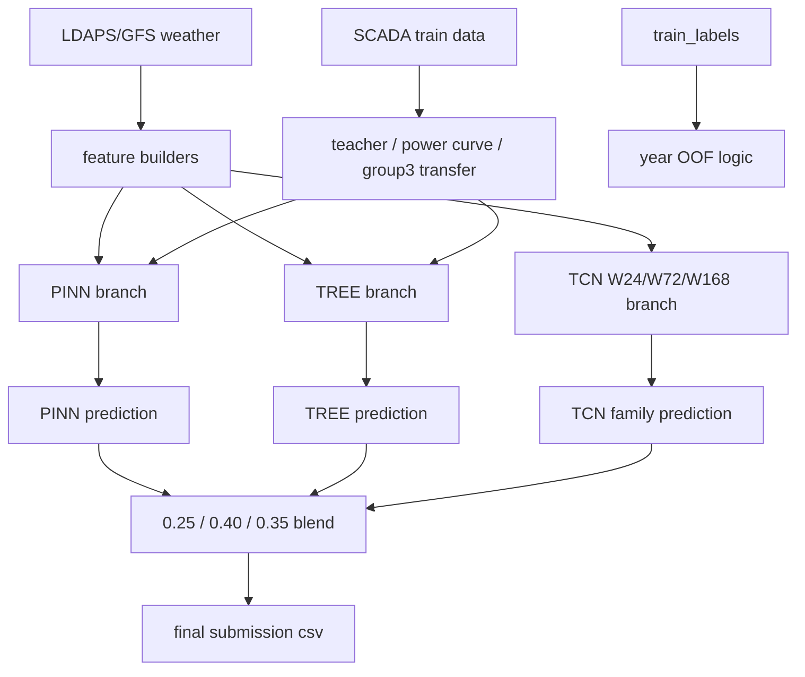

# Best Model Usage And Handoff

작성일: 2026-07-10 KST

이 문서는 새 Codex 세션이나 외부 리뷰어에게 현재 최고 public 모델을 빠르게 인수인계하기 위한 문서다. 실험 로그가 아니라 **현재 최고 제출을 어떻게 이해하고 재현하는지**에 초점을 둔다.

## 1. 현재 최고 기준

| Item | Value |
|---|---|
| Best file | `results/submission_pinn25_tree40_tcn35_tree_g3_vestas_pseudo2022_w010.csv` |
| Public score | `0.6370788926` |
| Public 1-nMAE | `0.8701764551` |
| Public FiCR | `0.4039813302` |
| Memo | `pinn25_tree40_tcn35_tree_g3_vestas_pseudo2022` |

주의:

- `results/submission.csv`는 작업 중 계속 덮어쓰는 임시 제출 파일이다.
- 현재 최고 모델을 가리킬 때는 반드시 위의 고유 파일명을 기준으로 본다.
- 과거 문서의 `PINN50 + TREE50` 구조는 구버전이다. 현재 최고는 `PINN25 + TREE40 + TCN35`다.

## 2. 한 줄 파이프라인

```text
final = 0.25 * PINN + 0.40 * TREE + 0.35 * TCN_family

TCN_family = 0.30 * TCN_W24 + 0.40 * TCN_W72 + 0.30 * TCN_W168
```

현재 최고 public에서는 `soft_metric TCN`이 아니라 **기존 weighted L1 TCN family**를 사용한다.

## 3. 전체 데이터 흐름



## 4. Branch 역할

| Branch | Weight | 역할 | 현재 기준 파일 |
|---|---:|---|---|
| PINN | `0.25` | SCADA teacher/effective wind 기반 물리 모델. peak/FICR 보조 역할 | `results/submission_pinn_lgbm_teacher_year_bagging_stage2_es.csv` |
| TREE | `0.40` | tuned LGBM tabular model. nMAE와 안정성 주력 | `results/submission_tree_lgbm_best_v2_l1_aggressive_minimal_rolling_v1_g3_vestas_pseudo2022_w010.csv` |
| TCN W24 | TCN 내부 `0.30` | 짧은 시계열 window | `results/submission_seqnn_short_tcn_w24_v1.csv` |
| TCN W72 | TCN 내부 `0.40` | 중간 시계열 window. TCN family 중심 | `results/submission_seqnn_mid_tcn_w72_v1.csv` |
| TCN W168 | TCN 내부 `0.30` | 긴 시계열 window | `results/submission_seqnn_long_tcn_w168_v1.csv` |

TREE branch의 group3는 별도 보정이 들어간다.

```text
base TREE all groups
-> group3만 VESTAS teacher + pseudo2022 방식으로 다시 예측
-> group1/group2는 base TREE 유지, group3만 교체
```

이 방식이 public에서 가장 안전했다. TCN group3 pseudo2022까지 적용한 후보는 public이 낮아져 보류했다.

## 5. 빠른 재현: 이미 생성된 branch 파일을 블렌드

branch 파일들이 이미 `results/`에 있으면 아래 명령만으로 현재 최고 구조를 다시 만들 수 있다.

```powershell
conda run -n WindForecast python experiments\blend_three_branch_submission.py `
  --pinn results\submission_pinn_lgbm_teacher_year_bagging_stage2_es.csv `
  --tree results\submission_tree_lgbm_best_v2_l1_aggressive_minimal_rolling_v1_g3_vestas_pseudo2022_w010.csv `
  --tcn24 results\submission_seqnn_short_tcn_w24_v1.csv `
  --tcn72 results\submission_seqnn_mid_tcn_w72_v1.csv `
  --tcn168 results\submission_seqnn_long_tcn_w168_v1.csv `
  --pinn-weight 0.25 `
  --tree-weight 0.40 `
  --tcn-family-weight 0.35 `
  --tcn24-weight 0.30 `
  --tcn72-weight 0.40 `
  --tcn168-weight 0.30 `
  --output results\submission_pinn25_tree40_tcn35_tree_g3_vestas_pseudo2022_w010_rebuild.csv
```

제출용 `results/submission.csv`까지 같이 갱신하려면 마지막에 아래 옵션을 추가한다.

```powershell
--also-update-submission-csv
```

단, 제출권이 제한되어 있으므로 `submission.csv` 갱신과 실제 제출은 사용자가 명시했을 때만 한다.

## 6. 전체 재생성 순서

아래는 branch 파일이 없거나 코드 변경 후 처음부터 다시 만들 때의 순서다.

### 6.1 PINN branch

```powershell
conda run -n WindForecast python predict_pinn_effective_grid_g1_year_bagging.py `
  --teacher-backend lgbm_time_oof `
  --output results\submission_pinn_lgbm_teacher_year_bagging_stage2_es.csv `
  --fold-stats-output results\pinn_lgbm_teacher_year_bagging_stage2_es_fold_stats.csv
```

핵심:

- year-bagging 구조다.
- 각 fold는 `2022,2023 -> 2024`, `2022,2024 -> 2023`, `2023,2024 -> 2022` 형태다.
- test는 세 fold 모델의 예측 평균이다.
- SCADA raw 값을 test처럼 직접 넣지 않고, weather 기반 teacher 예측값을 사용한다.
- early stopping은 기본 활성화다.

### 6.2 TREE base branch

```powershell
conda run -n WindForecast python predict_power_lgbm_best.py `
  --best-csv results\power_lgbm_hyperparams_v2_l1_20_best.csv `
  --feature-profile aggressive_minimal_rolling_v1 `
  --output results\submission_tree_lgbm_best_v2_l1_aggressive_minimal_rolling_v1.csv
```

핵심:

- group별 tuned LGBM을 사용한다.
- 하이퍼파라미터는 `results/power_lgbm_hyperparams_v2_l1_20_best.csv` 기준이다.
- feature profile은 현재 최고 기준 `aggressive_minimal_rolling_v1`이다.
- low-output cutoff와 sample weighting이 들어간다.

### 6.3 TREE group3 VESTAS pseudo2022 보정

```powershell
conda run -n WindForecast python experiments\predict_tree_group3_pseudo2022_submission.py `
  --base-tree-submission results\submission_tree_lgbm_best_v2_l1_aggressive_minimal_rolling_v1.csv `
  --best-csv results\power_lgbm_hyperparams_v2_l1_20_best.csv `
  --feature-profile aggressive_minimal_rolling_v1 `
  --pseudo-weight 0.10 `
  --output results\submission_tree_lgbm_best_v2_l1_aggressive_minimal_rolling_v1_g3_vestas_pseudo2022_w010.csv
```

핵심:

- group3는 2022 target이 없어서 데이터 부족 문제가 크다.
- VESTAS 쪽 2022-2024 학습 정보를 활용해 group3의 2022 pseudo target을 만든다.
- pseudo row 가중치는 `0.10`이다.
- 이 보정은 TREE branch에만 적용한 버전이 현재 public 최고다.

### 6.4 TCN W24

```powershell
conda run -n WindForecast python experiments\predict_seqnn_submission.py `
  --model tcn `
  --window 24 `
  --stem submission_seqnn_short_tcn_w24_v1
```

### 6.5 TCN W72

```powershell
conda run -n WindForecast python experiments\predict_seqnn_submission.py `
  --model tcn `
  --window 72 `
  --stem submission_seqnn_mid_tcn_w72_v1
```

### 6.6 TCN W168

```powershell
conda run -n WindForecast python experiments\predict_seqnn_submission.py `
  --model tcn `
  --window 168 `
  --stem submission_seqnn_long_tcn_w168_v1
```

TCN 기본 설정:

| Setting | Value |
|---|---:|
| model | `tcn` |
| loss | `weighted_l1` |
| weight policy | `actual_sqrt` |
| epochs | `120` |
| patience | `18` |
| hidden size | `64` |
| layers | `1` |
| kernel size | `3` |
| dropout | `0.10` |
| lr | `1e-3` |
| weight decay | `1e-4` |

soft metric loss TCN은 OOF에서는 좋아 보였지만 public 최고를 넘지 못했으므로 현재 최고 재현에는 쓰지 않는다.

### 6.7 Final blend

```powershell
conda run -n WindForecast python experiments\blend_three_branch_submission.py `
  --pinn results\submission_pinn_lgbm_teacher_year_bagging_stage2_es.csv `
  --tree results\submission_tree_lgbm_best_v2_l1_aggressive_minimal_rolling_v1_g3_vestas_pseudo2022_w010.csv `
  --tcn24 results\submission_seqnn_short_tcn_w24_v1.csv `
  --tcn72 results\submission_seqnn_mid_tcn_w72_v1.csv `
  --tcn168 results\submission_seqnn_long_tcn_w168_v1.csv `
  --pinn-weight 0.25 `
  --tree-weight 0.40 `
  --tcn-family-weight 0.35 `
  --tcn24-weight 0.30 `
  --tcn72-weight 0.40 `
  --tcn168-weight 0.30 `
  --output results\submission_pinn25_tree40_tcn35_tree_g3_vestas_pseudo2022_w010.csv
```

## 7. 검증 철학

기본 검증은 leave-one-year-out OOF다.

| Fold | Train years | Predict year |
|---|---|---|
| 1 | `2022, 2023` | `2024` |
| 2 | `2022, 2024` | `2023` |
| 3 | `2023, 2024` | `2022` |

중요 원칙:

- 검증 연도 raw SCADA를 teacher 입력으로 직접 쓰지 않는다.
- teacher feature는 train row도 OOF/crossfit 예측값으로 만든다.
- test는 각 leave-one-year model의 예측을 평균한다.
- 최종 예측은 group capacity 범위로 clamp한다.
- OOF 상승이 public 상승으로 항상 이어지지 않았으므로, 작은 OOF 개선만으로 제출 파일을 만들지 않는다.

## 8. 새 세션에게 반드시 알려줄 행동 규칙

새 세션은 아래 규칙을 먼저 읽고 지켜야 한다.

1. 실험 전에 목적, 파이프라인, 기대 효과를 사용자에게 먼저 설명한다.
2. 사용자가 명시하지 않으면 최종 weight를 임의로 바꾸지 않는다. 현재 기준은 `PINN 0.25 / TREE 0.40 / TCN 0.35`다.
3. 큰 OOF 개선 또는 사용자 명시 요청 없이 test submission을 새로 만들지 않는다.
4. `results/submission.csv`는 임시 파일이다. 성능을 말할 때는 고유 파일명을 기준으로 한다.
5. 외부 데이터는 `docs/rules.md` 기준을 따른다. 예측시점 이후 관측값 또는 same-time AWS는 final/test 입력으로 쓰면 안 된다.
6. exp log는 짧고 직관적으로 남긴다. 길고 복잡한 구조 설명은 별도 docs로 분리한다.
7. 기존 코드를 크게 바꾸기 전에 현재 파이프라인에서 어느 branch를 건드리는지 명확히 말한다.

## 9. 새 세션 시작용 요약문

새 세션을 팔 때 아래 내용을 그대로 넘기면 된다.

```text
현재 WindForecast 최고 public은
results/submission_pinn25_tree40_tcn35_tree_g3_vestas_pseudo2022_w010.csv 이다.

구조는 PINN 25% + TREE 40% + TCN family 35%이고,
TCN family는 W24 30% + W72 40% + W168 30%이다.

TREE branch는 aggressive_minimal_rolling_v1 tuned LGBM 기반이며,
group3만 VESTAS transfer + pseudo2022 weight 0.10으로 교체한 파일을 쓴다.

TCN은 soft_metric 버전이 아니라 weighted_l1 기본 TCN W24/W72/W168을 쓴다.
results/submission.csv는 임시 파일이므로 최고 파일로 간주하지 않는다.

작업 전에 docs/rules.md와 docs/best_model_usage.md를 먼저 읽고,
실험을 시작하기 전 목적/파이프라인/기대효과를 사용자에게 설명해야 한다.
작은 OOF 개선만으로 test submission을 만들지 말고, weight도 임의로 바꾸지 않는다.
```

## 10. 관련 문서

| Document | Purpose |
|---|---|
| `docs/current_best_structure_for_review.md` | 다른 관점 리뷰용 현재 구조 요약 |
| `docs/rules.md` | 대회 규칙, leakage, 외부 데이터 사용 기준 |
| `docs/exp_logs.md` | 짧은 실험 로그 |
| `docs/외부데이터.md` | 외부 AWS 데이터 검토 기록 |

