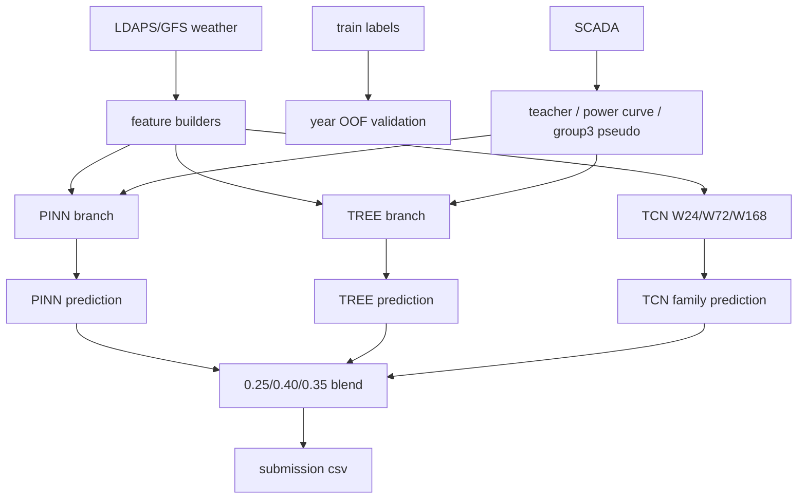

# Current Best Structure For Review

작성일: 2026-07-09 KST

목적: 다른 관점의 리뷰어가 현재 모델 구조, public 결과, 실패한 후보, 남은 의문점을 빠르게 이해하도록 정리한다. 이 문서는 실험 로그가 아니라 **현재 최고 public 구조의 요약본**이다.

## 1. 현재 최고 public 구조

현재 최고 public 제출은 아래 파일이다.

| Item | Value |
|---|---|
| Best file | `results/submission_pinn25_tree40_tcn35_tree_g3_vestas_pseudo2022_w010.csv` |
| Public score | `0.6370788926` |
| Public 1-nMAE | `0.8701764551` |
| Public FiCR | `0.4039813302` |
| Memo | `pinn25_tree40_tcn35_tree_g3_vestas_pseudo2022` |

주의: `results/submission.csv`는 마지막 확인용 제출 후보로 계속 덮어쓴다. 따라서 **현재 최고 모델을 의미하지 않을 수 있다.** 최고 public 구조는 위 파일명을 기준으로 본다.

상위권과의 차이:

| Team range | Score | 1-nMAE | FiCR |
|---|---:|---:|---:|
| Current best | `0.63708` | `0.87018` | `0.40398` |
| Leader example | `0.66703` | `0.87932` | `0.45473` |
| Gap | 약 `0.030` | 약 `0.009` | 약 `0.051` |

핵심 병목은 nMAE도 있지만, 특히 **FiCR 차이가 크다.**

## 2. 한 줄 구조

```text
final = 0.25 * PINN + 0.40 * TREE + 0.35 * TCN_family

TCN_family = 0.30 * TCN_W24 + 0.40 * TCN_W72 + 0.30 * TCN_W168
```

현재 최고 public에서는 TCN branch가 `soft_metric TCN`이 아니라 **기존 weighted L1 TCN family**이다.

## 3. Branch 역할

| Branch | Weight | 역할 | 강점 | 약점 |
|---|---:|---|---|---|
| PINN | `0.25` | SCADA teacher/effective wind 기반 물리 모델 | peak/FICR 보조, 물리적 clamp/curve 구조 | nMAE 약함, teacher 품질 의존 |
| TREE | `0.40` | tuned LGBM tabular model | nMAE와 안정성 주력 | FiCR/피크가 약함 |
| TCN family | `0.35` | weather sequence NN | ramp/시계열 패턴 보완 | 단독 성능은 불안정, public 일반화 확인 필요 |

## 4. 데이터 흐름



## 5. 현재 branch 파일

현재 최고 구조를 재현할 때 기준으로 보는 파일들:

| Component | File |
|---|---|
| PINN submission | `results/submission_pinn_lgbm_teacher_year_bagging_stage2_es.csv` |
| TREE submission | `results/submission_tree_lgbm_best_v2_l1_aggressive_minimal_rolling_v1_g3_vestas_pseudo2022_w010.csv` |
| TCN W24 submission | `results/submission_seqnn_short_tcn_w24_v1.csv` |
| TCN W72 submission | `results/submission_seqnn_mid_tcn_w72_v1.csv` |
| TCN W168 submission | `results/submission_seqnn_long_tcn_w168_v1.csv` |
| Final best public | `results/submission_pinn25_tree40_tcn35_tree_g3_vestas_pseudo2022_w010.csv` |

group3 pseudo2022는 현재 **TREE branch 쪽에 적용된 것이 public에서 가장 안전했다.** TCN group3 pseudo2022까지 추가한 후보는 오히려 public이 나빠져 보류했다.

## 6. Validation 방식

기본 검증은 leave-one-year-out OOF이다.

| Fold | Train years | Predict year |
|---|---|---|
| 1 | 2022, 2023 | 2024 |
| 2 | 2022, 2024 | 2023 |
| 3 | 2023, 2024 | 2022 |

중요 규칙:

- 검증 연도 raw SCADA를 teacher 입력으로 직접 쓰지 않는다.
- teacher feature는 train row도 OOF/crossfit 예측값으로 만든다.
- test는 각 leave-one-year model의 예측을 평균한다.
- 최종 예측은 평가/제출 전에 group capacity 범위로 clamp한다.
- group3는 2022 target이 없어 일부 OOF/SeqNN fold가 구조적으로 제한된다.

OOF에서 `PINN 0.25 / TREE 0.40 / TCN 0.35`는 유효했다.

| Variant | Mean score | Mean nMAE | Mean FiCR | 판단 |
|---|---:|---:|---:|---|
| TREE only | `0.62396` | `0.12809` | `0.37602` | 기준 |
| TCN family only | `0.62084` | `0.13797` | `0.37966` | 단독은 약함 |
| PINN only | `0.61293` | `0.14197` | `0.36783` | 단독은 약함 |
| PINN25/TREE40/TCN35 | `0.63088` | `0.12760` | `0.38937` | OOF best 계열 |

단, OOF 상승이 public에서 항상 유지되지는 않았다. 제출권이 제한되므로 큰 구조 변화가 아니면 test submission을 만들지 않는다.

## 7. 최근 public 확인 요약

| Candidate | Public score | 1-nMAE | FiCR | 판단 |
|---|---:|---:|---:|---|
| PINN25/TREE40/TCN35 + TREE g3 pseudo2022 | `0.6370788926` | `0.8701764551` | `0.4039813302` | 현재 최고 |
| PINN25/TREE40/softTCN35 | `0.6357518532` | `0.8692285391` | `0.4022751673` | OOF 대비 public 이득 없음 |
| soft TCN 관련 다른 후보 | `0.6362267968` | `0.8699141079` | `0.4025394858` | 현재 최고 미달 |
| XGB residual correction | 약 `0.6267` | `0.8605` | `0.3929` | 과적합/기각 |

결론: 현재 public에서는 **기존 TCN family + TREE group3 pseudo2022**가 soft loss TCN보다 안전하다.

## 8. 검토했지만 보류/기각한 큰 후보

| Candidate | 결과 | 판단 |
|---|---|---|
| soft_metric TCN loss | OOF에서는 TCN 단독 `0.632`대까지 상승, public은 최고 미달 | 보류 |
| LGBM custom soft metric objective | L1 baseline보다 OOF 악화 | 기각 |
| XGB residual correction | public `0.6267` 수준 | 과적합 의심, 기각 |
| SCADA availability / strong-zero feature | oracle 상한도 작고 feature 추가는 악화 | quantum jump 후보 아님 |
| seasonal baseline + residual TREE | TREE OOF 악화 | 기각 |
| zero/low target ffill | TREE는 이미 low-output mask가 있어 이득 없음 | TREE 경로 기각 |
| TCN group3 pseudo2022 | public에서 기존 최고보다 악화 | 보류 |

## 9. 가장 중요한 미해결 질문

1. 상위권은 FiCR을 `0.45` 근처까지 올리는데, 우리는 `0.40` 근처에서 막힌다.
2. group3는 여전히 가장 약한 축이다. 2022 target 부재와 제조사/SCADA 차이가 핵심일 가능성이 높다.
3. OOF 개선이 public에 잘 전달되지 않는 후보가 많다. 2025 test 분포와 OOF fold의 mismatch를 더 봐야 한다.
4. weather -> site/turbine wind 복원 단계가 아직 부족할 수 있다. 특히 풍향, 공간장, forecast lead/time alignment, hub-height proxy 쪽을 다시 봐야 한다.
5. 현재 구조가 branch 앙상블로는 꽤 강해졌지만, top gap을 보면 단순 후처리보다 **입력 데이터/전처리/feature 해석의 큰 누락** 가능성이 크다.

## 10. 다른 관점 리뷰어에게 먼저 맡길 일

실험 실행보다 아래 감사가 우선이다.

1. 데이터 시간 정렬 감사: `forecast_kst_dtm`, `data_available_kst_dtm`, lead time, train/test 생성 방식이 완전히 맞는지 확인.
2. 원본 데이터 사용 감사: LDAPS/GFS/SCADA/info.xlsx 중 현재 빠진 중요 정보가 있는지 확인.
3. group3 전용 감사: 2022 target 부재를 보완하는 더 정합적인 transfer 방법 확인.
4. 풍향/공간 구조 감사: raw 풍향이 아니라 단지축, 입사각, wake, upwind/downwind gradient로 쓰는 방법 검토.
5. metric 감사: FiCR을 올리는 모델링/후처리가 public에서 깨지는 이유 확인.

## 11. 작업 원칙

- 실험 전 목적, 파이프라인, 기대 효과를 먼저 설명한다.
- 사용자가 명시하지 않으면 weight를 임의로 바꾸지 않는다.
- 큰 OOF 개선 또는 사용자 명시 요청 없이 test submission을 만들지 않는다.
- `results/submission.csv`는 작업 중 계속 덮일 수 있으므로, 중요한 후보는 고유 파일명으로 판단한다.
- exp log는 짧게 남기고, 구조 설명은 이 문서처럼 별도 요약 문서로 유지한다.

