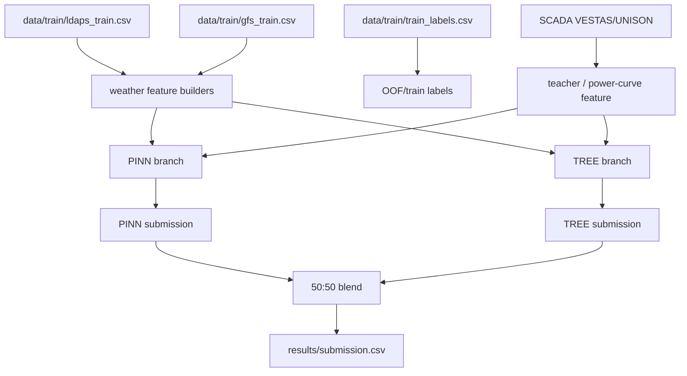

# Current Pipeline Map

작성일: 2026-07-09 KST

목적: 현재 최고 성능 구조가 실제로 어떤 파일, 데이터, 중간 feature, 검증/제출 경로를 타는지 한 장으로 고정한다. 이후 리팩토링은 이 문서를 기준으로 안전하게 진행한다.

## 현재 기준 모델

현재 기준은 **PINN 50 : TREE 50** 이다.

| Branch | 현재 기준 파일 | 주요 출력 | 역할 |
|---|---|---|---|
| PINN | `predict_pinn_effective_grid_g1_year_bagging.py` | `results/submission_pinn_lgbm_teacher_year_bagging.csv` | SCADA teacher/effective wind 기반 물리 모델 |
| TREE | `predict_power_lgbm_best.py` | `results/submission_tree_lgbm_best_v2_l1.csv` | tuned group별 LGBM 회귀 |
| BLEND | `blend_submission_files.py` | `results/submission.csv` | PINN/TREE 50:50 제출 생성 |

주의: `docs/inference_structure.md`에는 예전 tree compact 경로가 남아 있다. 현재 최고 기준 문서는 `docs/best model pipeline.md`와 이 문서로 본다.

## 전체 데이터 흐름



## Validation 기준

검증은 leave-one-year-out OOF가 기본이다.

| Fold | Train years | Predict year |
|---|---|---|
| 1 | 2023, 2024 | 2022 |
| 2 | 2022, 2024 | 2023 |
| 3 | 2022, 2023 | 2024 |

핵심 규칙:

- 검증 연도 raw SCADA를 teacher 입력으로 직접 쓰지 않는다.
- teacher feature는 train row도 OOF/crossfit 예측값이어야 한다.
- power-curve feature도 train row는 OOF curve, valid/test row는 train-period curve로 만든다.
- 최종 예측은 group capacity 범위로 clamp한다.

## PINN Branch

### 실행 경로

검증:

```powershell
conda run -n WindForecast python experiments\evaluate_pinn_effective_grid_g1_year_bagging_oof.py --teacher-backend lgbm_time_oof
```

제출용:

```powershell
conda run -n WindForecast python predict_pinn_effective_grid_g1_year_bagging.py --teacher-backend lgbm_time_oof --output results\submission_pinn_lgbm_teacher_year_bagging.csv --fold-stats-output results\pinn_lgbm_teacher_year_bagging_fold_stats.csv
```

### 내부 흐름

```text
LDAPS/GFS
-> build_extended_pinn_weather
-> all_meteo block
-> optional effective grid features
-> SCADA teacher crossfit
-> group별 PINN weather
-> VESTAS PINN: group1 + group2
-> UNISON PINN: group3
-> test 예측
-> 3개 year-bag fold 평균
```

### 주요 파일

| 역할 | 파일 |
|---|---|
| PINN 제출 생성 | `predict_pinn_effective_grid_g1_year_bagging.py` |
| PINN OOF 검증 | `experiments/evaluate_pinn_effective_grid_g1_year_bagging_oof.py` |
| PINN 학습/teacher 공통 로직 | `utils/pinn_effective_pipeline.py` |
| PINN 하이퍼파라미터 적용 | `utils/pinn_scada_teacher_config.py` |
| 모델 정의 | `models/pinn.py` |
| 기본 학습 상수/physics loss | `train_pinn.py` |

### SCADA teacher target

`utils/pinn_effective_pipeline.py` 기준:

- `scada_ws_mean`
- `scada_ws_std`
- `scada_ws_p10`
- `scada_ws_p50`
- `scada_ws_p75`
- `scada_ws_p90`
- `scada_ws_max`
- `scada_ws_cubic`
- `scada_ws_ramp`
- `scada_wd_sin`
- `scada_wd_cos`
- `scada_wd_concentration`
- `scada_wd_spread`
- `scada_wd_sin_std`
- `scada_wd_cos_std`
- `scada_ws_dir_sin`
- `scada_ws_dir_cos`

teacher backend:

- 현재 최고 기준은 `lgbm_time_oof`
- 코드 기본값은 아직 `rf_oob`로 남아 있으므로 실행 인자 또는 config 정리가 필요하다.

group별 teacher 사용:

| Group | Weather base | SCADA source | v mode |
|---|---|---|---|
| group1 | effective grid | VESTAS | cubic |
| group2 | canonical | VESTAS | p90 |
| group3 | canonical | UNISON + VESTAS mix | p90 / VESTAS group2 proxy |

group3는 UNISON teacher와 VESTAS teacher를 `0.30` 비율로 섞는다. 이 구조는 group3 데이터 부족 보완용이다.

## TREE Branch

### 실행 경로

검증:

```powershell
conda run -n WindForecast python experiments\evaluate_power_lgbm_best.py --best-csv results\power_lgbm_hyperparams_v2_l1_20_best.csv --stem power_lgbm_best_v2_l1 --train-policy-name best_lgbm_v2_l1
```

제출용:

```powershell
conda run -n WindForecast python predict_power_lgbm_best.py --best-csv results\power_lgbm_hyperparams_v2_l1_20_best.csv --output results\submission_tree_lgbm_best_v2_l1.csv
```

### 내부 흐름

```text
LDAPS/GFS
-> build_all_meteo_compact_v2
-> build_weather_features
-> all_meteo
-> compact physics features
-> OOF SCADA power-curve feature
-> low-output train mask
-> sample weight
-> group별 tuned LGBM
-> test 예측
```

### 주요 파일

| 역할 | 파일 |
|---|---|
| TREE 제출 생성 | `predict_power_lgbm_best.py` |
| TREE OOF 검증 | `experiments/evaluate_power_lgbm_best.py` |
| TREE hyperparameter search | `experiments/tune_power_lgbm_hyperparams.py` |
| compact weather/physics feature | `predict_tree_compact_physics_v2.py`, `utils/compact_physics_features.py` |
| base weather aggregation | `utils/preprocessing.py` |
| meteo feature block | `utils/meteo_features.py` |
| SCADA power curve | `utils/power_curve.py` |

### TREE policy

현재 tuned LGBM은 group별 best row를 `results/power_lgbm_hyperparams_v2_l1_20_best.csv`에서 읽는다.

공통적으로 중요한 정책:

- objective: mostly `regression_l1`
- low-output cutoff: `min_output_ratio`
- sample weight: `actual_sqrt` 또는 탐색 결과
- prediction clamp: `[0, group_capacity]`

### SCADA 사용 위치

TREE 기본 경로는 raw SCADA를 직접 feature로 넣지 않는다. SCADA는 다음에만 사용된다.

1. train-period empirical power curve fitting
2. train row OOF power curve estimate
3. optional `--use-scada-wd-teacher` 경로

현재 최고 기준에서는 optional WD teacher는 기본값이 아니다.

## BLEND Branch

실행:

```powershell
conda run -n WindForecast python blend_submission_files.py --base results\submission_pinn_lgbm_teacher_year_bagging.csv --extra results\submission_tree_lgbm_best_v2_l1.csv --extra-weight 0.5 --out results\submission.csv
```

수식:

```text
final = 0.5 * PINN + 0.5 * TREE
```

규칙:

- 사용자가 명시하기 전까지 50:50을 기본값으로 둔다.
- 후처리/weight 변경은 모델 개선과 분리한다.
- test submission은 큰 OOF 개선 또는 사용자 명시 요청이 있을 때만 만든다.

## 현재 구조상 혼선/리팩토링 대상

| 문제 | 현재 상태 | 정리 방향 |
|---|---|---|
| 오래된 문서 경로 | `inference_structure.md`가 예전 tree compact 파일을 가리킴 | 현재 최고 기준 문서로 통일 |
| teacher backend 기본값 | 코드 기본값 `rf_oob`, 실행 권장 `lgbm_time_oof` | config/CLI 기본값 명확화 |
| feature builder 중복 | PINN/TREE weather builder가 따로 존재 | 공통 data/feature layer 분리 |
| direction 처리 혼선 | `utils/preprocessing.py`에 direction drop 주석 존재 | direction family를 별도 표준 feature로 재도입 |
| 실험 옵션이 core에 섞임 | PINN OOF에 GRU/bias/WD correction 옵션이 같이 존재 | core stable path와 experiment 옵션 분리 |
| OOF schema 불통일 | PINN/TREE/blend 예측 CSV column 구조 다름 | pipeline contract로 표준화 |
| 결과 파일 과밀 | `results/`에 오래된 실험 산출물이 많음 | keep/archive/delete 분류 필요 |

## 대회/현업 코드에서 적용할 패턴

이 문서의 다음 리팩토링은 `docs/external_code_reference.md`의 패턴을 현재 구조에 이식하는 방향으로 진행한다.

### 1. SCADA invalid mask / availability

외부 KDD 코드들은 발전량 이상치를 loss mask로 다룬다.

우리 적용 후보:

- `SCADA -> invalid/availability feature/weight`
- target residual 기반 이상치 탐지 금지
- label delete보다 sample weight 우선

### 2. Direction-conditioned effective wind

FLORIS/PyWake 기준 풍향은 wake/yaw/입사각 구조다.

우리 적용 후보:

- wind direction sin/cos 재도입
- group/site axis 기반 along/cross component
- direction bin 또는 Fourier basis 기반 낮은 자유도 correction
- upwind/downwind grid aggregation

### 3. Spatial representation

KDD GNN 계열은 geo/DTW/cosine graph를 쓴다.

우리 적용 후보:

- turbine graph 대신 weather grid graph-like stats
- nearest/mean/idw/upwind/p90-p10/gradient family 정리
- group3 개선을 위한 shared/global spatial encoder

### 4. Direct sequence model

GRU/TCN/DLinear은 residual이 아니라 direct forecast sibling으로 둔다.

우리 적용 후보:

- `weather sequence -> power`
- 또는 `weather sequence -> effective wind -> power`
- OOF 단독 성능과 PINN/TREE residual 상관관계 먼저 확인

### 5. Feature family registry

500개 feature를 유지하더라도 family 단위로 켜고 꺼야 한다.

우선 family:

- calendar
- raw wind
- wind power / `rho * ws^3`
- vertical shear / veer
- direction component
- spatial grid stats
- weather ramp
- SCADA teacher/effective weather
- low-value meteo

## 다음 리팩토링 순서

1. `docs/pipeline_contract.md` 작성
2. prediction CSV schema 표준화
3. feature family registry 설계
4. stable entrypoint와 experiment entrypoint 분리
5. teacher/effective weather 모듈 분리
6. TREE 경로를 표준 pipeline에 먼저 이식
7. PINN 경로를 표준 pipeline에 연결
8. SeqNN 후보는 표준 pipeline 위에 새 branch로 추가

## 절대 유지 규칙

- 현재 최고 submission 재현 경로는 리팩토링 전후로 보존한다.
- 실험 실행 전에는 목적, 변경점, 고정점, validation, 기대효과, 위험, 생성 파일을 사용자에게 설명한다.
- 큰 개선 없이 test submission을 만들지 않는다.
- 기본 ensemble은 `PINN 50 : TREE 50`이다.
